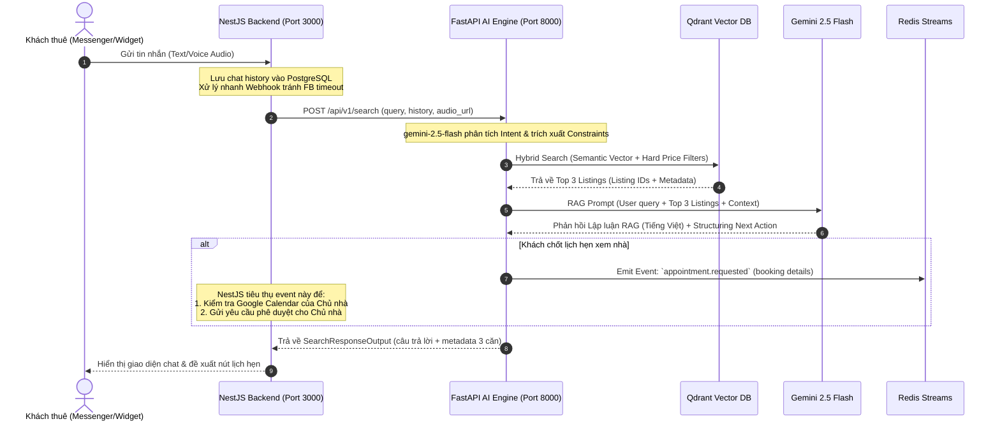

# Implementation Plan — Agent 2: The Super Broker

This document outlines the detailed technical design, components, and step-by-step implementation roadmap for building **Agent 2: The Super Broker** in the FastAPI AI Engine. 

Agent 2 serves as a **Semantic Context & Conversational Search Assistant** operating 24/7. It enables tenants to search for apartments using natural language (text or voice) and schedules viewing appointments asynchronously.

---

## 📐 Architecture & System Flow

Agent 2 interfaces with Qdrant for semantic vector search, utilizes `gemini-2.5-flash` for high-fidelity cognitive reasoning/constraints parsing, and coordinates with NestJS asynchronously via **Redis Streams**.



---

## 📋 Proposed Changes

The changes are scoped entirely within the FastAPI AI Engine folder (`D:\fastapi-ai-engine`).

```
D:\fastapi-ai-engine\
│
├── app\
│   ├── api\
│   │   └── routes\
│   │       ├── [NEW] route_broker.py       # API routes for Tenant Search & Booking
│   │
│   ├── schemas\
│   │   ├── [NEW] schema_broker.py      # Pydantic search query & response structures
│   │
│   ├── prompts\
│   │   ├── [NEW] prompt_broker.py      # System Prompts for Intent Parsing & RAG Reasoning
│   │
│   ├── agents\
│   │   ├── [NEW] agent_broker.py       # Agent 2 Core logic (RAG pipeline)
│   │
│   ├── services\
│   │   ├── [MODIFY] qdrant_service.py  # Add Embeddings Helper & Indexing functions
│   │   └── [NEW] redis_consumer.py     # Background worker to consume listing.approved
│   │
│   └── [MODIFY] main.py                # Register Lifespan task & new broker router
```

---

### 1️⃣ Core Services & Background Indexing Consumer

#### [MODIFY] [qdrant_service.py](file:///D:/fastapi-ai-engine/app/services/qdrant_service.py)
*   **Embeddings Generation:** Add `get_embedding(text: str) -> list[float]` using the Google GenAI API (`text-embedding-004`).
*   **Upsert Point:** Add `upsert_apartment_vector(listing_data: dict)` to index listing data into the `apartments` collection. Use a deterministic UUID (hashed from `listing_id`) as the point ID to guarantee idempotency.
*   **Vector Search:** Add `search_apartments(vector: list[float], filter_queries: Optional[dict] = None) -> list[dict]` to query Qdrant with semantic vector similarity and runtime constraint filters (price, area, amenities).

#### [NEW] [redis_consumer.py](file:///D:/fastapi-ai-engine/app/services/redis_consumer.py)
*   **Consumer Worker:** A background Thread/Task that runs alongside FastAPI.
*   **Stream Consumption:** Reads from the `listing.approved` Redis Stream.
*   **Replay Capacity:** On startup, reads from `0-0` to synchronize historical approved listings into Qdrant, then polls for fresh messages (`$`).
*   **Handler:** Extracts `listing_id`, `title`, `description`, `price`, `area`, `room_number`, and `metadata` from the stream message, constructs the payload vector using `get_embedding`, and upserts into Qdrant.

---

### 2️⃣ System Prompts & Validation Schemas

#### [NEW] [schema_broker.py](file:///D:/fastapi-ai-engine/app/schemas/schema_broker.py)
Implements all request and response structures as approved in `agent_broker_design.md`:
*   `ChatMessage`: role (`user`, `assistant`), content.
*   `SearchQueryInput`: `query`, `tenant_id`, `conversation_history`, and optional `audio_url`.
*   `RecommendedListing`: `listing_id`, `title`, `price_per_month`, `image_url`, `room_number`, `area`, `reason`.
*   `SearchResponseOutput`: `bot_response`, `recommendations`, `next_action`, `booking_details`.
*   Internal schemas like `QueryIntentConstraints` to parse user queries cleanly (price budget, min area, semantic query, booking request).

#### [NEW] [prompt_broker.py](file:///D:/fastapi-ai-engine/app/prompts/prompt_broker.py)
*   `INTENT_EXTRACTION_PROMPT`: Directs Gemini to extract hard filters (budget, area, pets, parking) and format a clean semantic search query. Also detects booking intents (`is_booking_request`, `booking_date`, `booking_time`).
*   `SYSTEM_INSTRUCTION`: The "Super Broker" persona instruction ensuring professional tone, context-rich reasoning, constraint enforcement, and strict injection protection.

---

### 3️⃣ Business Logic (AI Agent) & Routing

#### [NEW] [agent_broker.py](file:///D:/fastapi-ai-engine/app/agents/agent_broker.py)
Implements the core two-stage AI search pipeline:
*   **Stage 1 (Intent Analysis):** Calls `gemini-2.5-flash` with the user query, audio data (if `audio_url` is present, it fetches and attaches audio binary to Gemini), and history to extract constraints into a structured model.
*   **Stage 2 (Hybrid Vector Search):** Embeds the semantic query and searches Qdrant with filters. If zero matches are found, it invokes a **Constraint Relaxation** fallback (e.g. stripping price filters or minor amenities) to still present matches.
*   **Stage 3 (RAG & Synthesis):** Submits user query + retrieved listing metadata + chat history to Gemini to generate the final `SearchResponseOutput`.
*   **Booking Handler:** If an appointment is confirmed (`next_action` == `EMIT_BOOKING_EVENT`), it emits the `appointment.requested` event to Redis Streams.

#### [NEW] [route_broker.py](file:///D:/fastapi-ai-engine/app/api/routes/route_broker.py)
*   Exposes `POST /api/v1/search` pointing to `agent_broker.py`.
*   Includes robust error handling (`RateLimitError`, `PermissionDeniedError`, etc.) matching standard patterns in `route_verifier.py`.

#### [MODIFY] [main.py](file:///D:/fastapi-ai-engine/app/main.py)
*   Integrates `route_broker.py` into the FastAPI instance.
*   Initializes the Qdrant collection on startup and registers the background `redis_consumer` thread within the `lifespan` manager for safe start/stop.

---

## 🔍 Open Questions & Assumptions

We assume:
1. **Google GenAI OpenAI Compatibility:** The OpenAI-compatible API endpoint `/v1beta/openai` or direct REST API handles both chat completions and embeddings generation. We will build a fallback HTTP client for embeddings to guarantee safety.
2. **Audio Multimodality:** If the user supplies `audio_url`, we assume it contains a readable format (mp3/wav/ogg) and we download and submit it as a raw part to `gemini-2.5-flash`.
3. **Redis / Qdrant Availability:** The local Docker container dependencies (Redis & Qdrant) are up and configured correctly.

---

## 🧪 Verification Plan

### Automated Tests
1. **Unit Tests:**
   *   Test embedding generation & Qdrant upsert/search logic in `app/tests/test_qdrant.py`.
   *   Test intent analysis & constraint parsing in `app/tests/test_agent_broker.py`.
2. **Integration & API Tests:**
   *   Run end-to-end FastAPI endpoint tests: `POST /api/v1/search` with text query and conversation history.
   *   Test background indexing consumer by publishing an event to `listing.approved` via Redis CLI/Python script and verifying it gets upserted into Qdrant.

### Manual Verification
*   Execute simulated conversations through `/docs` Swagger UI.
*   Validate constraint relaxation behavior by querying with an unrealistically low budget (e.g. "tìm căn hộ dưới 1 triệu") and verifying that the agent relaxes constraints politely and proposes closest alternatives.
