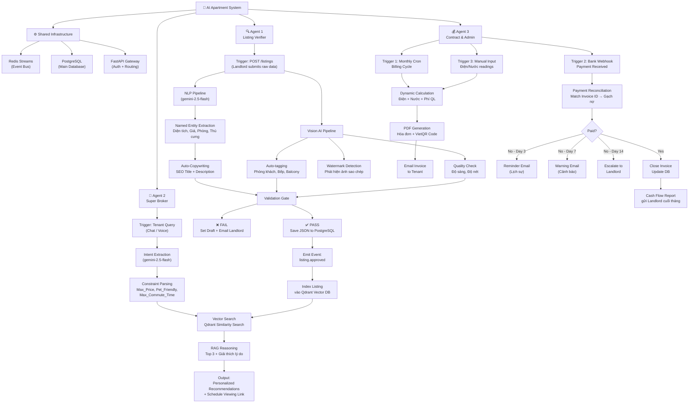

# 🏢 AI-Integrated Apartments — 3-Agent System Design

> **Status:** Design Phase — Pending Implementation Approval  
> **Scale:** 100 căn hộ / 1,000 users  
> **LLM:** gemini-2.5-flash | **Event Bus:** Redis Streams | **Vector DB:** Qdrant

---

## 📐 PHẦN 1 — System Architecture Overview

### Triết lý kiến trúc

Ba agent hoạt động **độc lập** (loosely coupled) nhưng **phối hợp** qua Redis Streams event bus.  
Mỗi agent là một **FastAPI service riêng** (hoặc module riêng trong monorepo), có thể deploy và scale độc lập.

```
┌─────────────────────────────────────────────────────────┐
│                    CLIENT LAYER                         │
│  Landlord App     Tenant Chat     Admin Dashboard       │
└────────────┬────────────┬─────────────┬────────────────┘
             │            │             │
             ▼            ▼             ▼
┌─────────────────────────────────────────────────────────┐
│              FastAPI Gateway (Shared)                   │
│         Auth · Rate Limit · Request Routing             │
└──┬─────────────┬──────────────┬──────────────┬──────────┘
   │             │              │              │
   ▼             ▼              ▼              ▼
┌──────┐    ┌──────┐      ┌──────┐
│Agent1│    │Agent2│      │Agent3│
│Listing    │Super │      │Contract
│Verif.│    │Broker│      │&Admin│
└──┬───┘    └──┬───┘      └──┬───┘
   │           │              │
   └─────────────────┬────────┘
                     ▼
         ┌───────────────────────┐
         │   Redis Streams       │
         │   (Shared Event Bus)  │
         └───────────┬───────────┘
                     │
        ┌────────────┴───────────┐
        ▼                        ▼
┌───────────────┐      ┌──────────────────┐
│  PostgreSQL   │      │  Qdrant Vector   │
│  (Main DB)    │      │  (Agent 2 only)  │
└───────────────┘      └──────────────────┘
```

---

## 🌳 PHẦN 2 — Full Workflow Tree



---

## 📡 PHẦN 3 — Redis Streams Event Map

Đây là bản đồ tất cả các **events** lưu chuyển qua Redis Streams:

| Stream Name | Producer | Consumer | Payload |
|---|---|---|---|
| `listing.approved` | Agent 1 | Agent 2 | `{listing_id, embedding_data, metadata}` |
| `listing.rejected` | Agent 1 | — | `{listing_id, reason, landlord_email}` |
| `invoice.generated` | Agent 3 | — | `{invoice_id, tenant_id, amount, pdf_url}` |
| `payment.received` | Agent 3 | — | `{invoice_id, amount, timestamp}` |

---

## 🗂️ PHẦN 4 — Folder Structure (Monorepo thực tế)

> ⚠️ **Quan sát từ codebase thực:** Nhóm FastAPI đang dùng **flat-file naming convention**.
> Pattern: `agent_*.py` / `route_*.py` / `prompt_*.py` / `schema_*.py`

```
fastapi-ai-engine/                   ← MONOREPO ROOT (NestJS + FastAPI chung 1 repo)
│
├── src/                             ← 🟦 NHÓM NESTJS (Backend chính, sở hữu DB qua Prisma)
│   ├── apartment/
│   │   ├── dto/
│   │   │   ├── create-apartment.dto.ts  # Validate input tạo căn hộ
│   │   │   └── update-apartment.dto.ts
│   │   ├── apartment.controller.ts      # REST: POST/GET/PATCH /apartment
│   │   ├── apartment.module.ts
│   │   └── apartment.service.ts         # CRUD Prisma → PostgreSQL
│   │
│   ├── listing/
│   │   ├── dto/
│   │   │   ├── create-listing.dto.ts    # Validate input tạo listing
│   │   │   ├── update-listing.dto.ts
│   │   │   └── search-listing.dto.ts    # Filter: keyword, minPrice, maxPrice
│   │   ├── listing.controller.ts        # REST: POST/GET /listing, GET /listing/search
│   │   ├── listing.module.ts
│   │   └── listing.service.ts           # ← 🔗 ĐIỂM KẾT NỐI VỚI FASTAPI
│   │                                    #   findWithInfor() đã format data cho Agent
│   │                                    #   TODO: thêm callAiVerifier() gọi FastAPI
│   │
│   ├── prisma/
│   │   ├── prisma.module.ts
│   │   └── prisma.service.ts            # Prisma client — kết nối PostgreSQL
│   │
│   ├── app.module.ts                    # Root NestJS module
│   └── main.ts                          # Entry — chạy port 3000
│
├── app/                             ← 🟩 NHÓM FASTAPI (AI Engine, chạy port 8000)
│   │
│   ├── agents/                      # Business logic AI — mỗi file = 1 agent
│   │   ├── agent_verifier.py        # ✅ Agent 1 — Listing Verifier (đã có)
│   │   │                            #   instructor + OpenAI-compat → gemini-2.5-flash
│   │   │                            #   verify_listing(payload) → listingVerifiedOutput
│   │   ├── agent_broker.py          # 🔵 Agent 2 — Super Broker
│   │   └── agent_admin.py           # 💰 Agent 3 — Contract & Admin
│   │
│   ├── api/
│   │   └── routes/                  # HTTP endpoints — NestJS gọi vào đây
│   │       ├── route_verifier.py    # ✅ POST /api/v1/verify-listing (đã có)
│   │       ├── route_broker.py      # POST /api/v1/search
│   │       └── route_admin.py       # POST /api/v1/invoice + /api/v1/webhook/payment
│   │
│   ├── prompts/                     # System prompts tách riêng — chỉnh không cần sửa code
│   │   ├── prompt_verifier.py       # ✅ Prompt Agent 1 (đã có)
│   │   ├── prompt_broker.py         # Prompt intent extraction + RAG reasoning
│   │   └── prompt_admin.py          # Prompt email nhắc nợ (lịch sự / cảnh báo)
│   │
│   ├── schemas/                     # Pydantic I/O contracts — NestJS phải tuân theo
│   │   ├── schema_verifier.py       # ✅ rawListingInput → listingVerifiedOutput
│   │   ├── schema_broker.py         # searchQueryInput → searchResultOutput
│   │   └── schema_admin.py          # utilityReadingInput → invoiceOutput
│   │
│   ├── services/                    # External service integrations (dùng chung)
│   │   ├── qdrant_service.py        # Vector index + similarity search (Agent 2)
│   │   ├── email_service.py         # SMTP dispatcher (Agent 3)
│   │   ├── pdf_service.py           # Render PDF hóa đơn (Agent 3)
│   │   └── vietqr_service.py        # Tạo mã QR VietQR (Agent 3)
│   │
│   ├── core/
│   │   └── config.py                # ✅ Load .env → settings (đã có)
│   │
│   └── main.py                      # ✅ FastAPI entry — mount tất cả routes
│
x1─ .env                             # ⚠️ KHÔNG commit — secrets thực
│                                    #   GEMINI_API_KEY, REDIS_URL, QDRANT_URL
│                                    #   SMTP_HOST/USER/PASS
│                                    #   FASTAPI_URL=http://localhost:8000  ← NestJS dùng
├── .env.example                     # Template — commit được
├── docker-compose.yml               # Redis + Qdrant (local dev)
└── requirements.txt                 # fastapi, instructor, openai, qdrant-client...
```

---

## 🔗 PHẦN 4B — NestJS ↔ FastAPI Integration Map

```
AGENT 1 — Listing Verifier
──────────────────────────────────────────────────────────────────
  Landlord POST raw text
    → NestJS  POST /listing          (listing.controller.ts)
    → listing.service: lấy db_apartment_data từ Prisma
    → [TODO] callAiVerifier()
    → FastAPI POST /api/v1/verify-listing
         Body: { rawText, owner_id, db_apartment_data }
    ← FastAPI trả về listingVerifiedOutput
    → NestJS lưu Prisma: title, description, price, status, amenities[]

AGENT 2 — Super Broker
──────────────────────────────────────────────────────────────────
  Tenant gửi câu hỏi chat
    → NestJS  GET /listing/search    (listing.controller.ts)
    → [TODO] callAiBroker()
    → FastAPI POST /api/v1/search
         Body: { query, tenant_id, conversation_history[] }
    ← FastAPI trả về top 3 listings + reasoning tiếng Việt

AGENT 3 — Contract & Admin
──────────────────────────────────────────────────────────────────
  Monthly cron (@Cron NestJS)
    → [TODO] callAiInvoice()
    → FastAPI POST /api/v1/invoice
         Body: {it_id, month, year, electricity_kwh, water_m3 }
    ← FastAPI tính tiền → PDF → Email tenant → trả invoice_id
  Bank webhook
    → FastAPI POST /api/v1/webhook/payment  (bank gọi trực tiếp)
    → reconcile → [TODO] callback NestJS cập nhật paid status
```
## ⚙️ PHẦN 5 — Tech Stack Summary

| Layer | Technology | Ghi chú |
|---|---|---|
| API Framework | FastAPI | AI Engine — port 8000 |
| NestJS Backend | NestJS + Prisma | Backend chính — port 3000, sở hữu DB |
| LLM | **gemini-2.5-flash** | Tất cả 3 agents (qua OpenAI-compat endpoint) |
| Structured Output | **instructor** library | Enforce Pydantic schema từ Gemini output |
| Vector Database | Qdrant | Agent 2 — self-hosted Docker |
| Main Database | PostgreSQL (Prisma) | NestJS sở hữu, FastAPI không trực tiếp read |
| Event Bus | Redis Streams | Shared — giai đoạn sau khi có Agent 2+ |
| PDF Generation | WeasyPrint / ReportLab | Agent 3 |
| QR Code | VietQR standard | Agent 3 |
| Email | SMTP (smtplib / FastMail) | Agent 3 |
| Container | Docker Compose | Redis + Qdrant (local dev) |

---


## 🔐 PHẦN 6 — Non-Functional Requirements

| Requirement | Value | Notes |
|---|---|---|
| Availability | 99% | Không cần HA phức tạp ở scale này |
| Response time (Agent 2) | < 3s | Chat UX yêu cầu |
| Response time (Agent 1) | < 30s | Vision AI + NLP pipeline |
| Data retention | 5 years | Hợp đồng, hóa đơn |
| Security | JWT Auth | Phân quyền landlord/tenant/admin |
| Privacy | Dữ liệu khách thuê | Không share giữa chủ nhà khác nhau |

---

## 📝 Decision Log

| # | Quyết định | Thay thế đã xét | Lý do chọn |
|---|---|---|---|
| D1 | Redis Streams làm event bus | Celery, Google Pub/Sub | Nhẹ nhất, đủ scale, không over-engineer |
| D2 | Qdrant làm vector DB | pgvector, Pinecone | Dedicated vector DB, dễ self-host, free |
| D3 | gemini-2.5-flash | GPT-4, Claude | Đồng bộ Google ecosystem, cost-effective |
| D4 | Email SMTP cho Agent 3 | Zalo OA, Telegram | Đơn giản nhất, đủ dùng để gửi nhắc nợ/hóa đơn |
| D5 | Monorepo | Microservices riêng | Scale 100 căn → không cần complexity của microservices |

---

## 🚀 Implementation Roadmap

### Phase 1 — Foundation (Tuần 1–2)
- [x] Agent 1: Listing Verifier (đã xong)
- [x] Setup Redis Streams client (shared)
- [x] Setup Qdrant (Docker)
- [ ] Emit `listing.approved` event từ Agent 1

### Phase 2 — Agent 2 (Tuần 3–4)
- [ ] Qdrant indexing consumer (nhận `listing.approved`)
- [ ] Intent extraction với gemini-3.1-flash-lite
- [ ] Vector search + RAG reasoning
- [ ] Chat API endpoint

### Phase 3 — Agent 3 (Tuần 5–6)
- [ ] Billing calculation engine
- [ ] PDF generation + VietQR
- [ ] Bank webhook receiver
- [ ] Dunning automation (3-7-14 day sequence)

