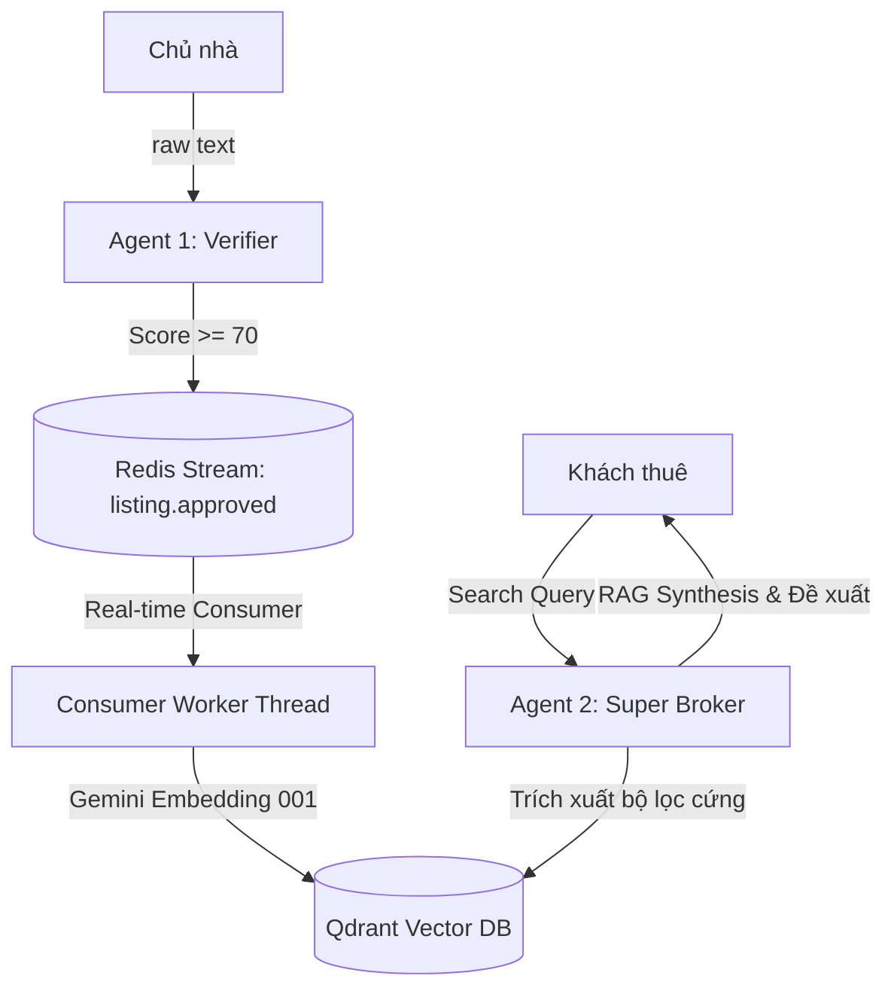

# Tóm tắt Công việc Thực hiện — Agent 2: The Super Broker

Tài liệu này tóm tắt toàn bộ quá trình phát triển, tích hợp, sửa lỗi và kiểm thử E2E hệ thống **Agent 2: The Super Broker** cho dự án tìm kiếm căn hộ tại Đà Nẵng.

---

## 1. Tổng quan Kiến trúc & Luồng Dữ liệu
Hệ thống AI Engine (FastAPI) hiện tại vận hành với sự phối hợp chặt chẽ giữa hai Agent:
1. **Agent 1 (Listing Verifier)**: Nhận tin đăng thô từ chủ nhà → Kiểm duyệt → Nếu đạt (`Published`), phát đi sự kiện `listing.approved` vào Red● Edit(/Users/ttcenter/.gemini/an...-9b23-da8b49f14622/task.md) (ctrl+o to expand)
  Chào bạn, tôi đã tạo file markdown tóm tắt chi tiết toàn bộ công việc đã thực 
  hiện:
  
  1. Trong workspace của bạn: walkthrough_agent2.md để bạn dễ dàng truy cập và xem
ngay.
  2. Trong thư mục artifact: walkthrough.md để lưu vết lịch sử phiên làm việc.  
  
  ### Tóm tắt các điểm nổi bật vừa được hoàn thành:
  
  • Tích hợp E2E thành công: Kết nối thành công Agent 1 (Kiểm duyệt) -> phát sự 
  kiện Redis Stream -> Redis Consumer (Xử lý nền) -> sinh Vector Embedding ->   
  lưu vào Qdrant -> Agent 2 (Super Broker) thực hiện tìm kiếm ngữ nghĩa và tư   
  vấn.
  • Sửa các lỗi hệ thống nghiêm trọng:
      • Chuyển đổi mô hình Embedding từ  gemini-embedding-001  (đã bị ngừng hỗ    
      trợ) sang  gemini-embedding-001  (3072 chiều) chạy mượt mà.
      • Tự động xóa và tái tạo lại Qdrant collection khi phát hiện dimension    
      không khớp (ví dụ: lệch giữa 768 chiều cũ và 3072 chiều mới).             
      • Khắc phục lỗi  AttributeError: 'QdrantClient' object has no attribute   
      'search'  trên Qdrant Python SDK v1.18+ bằng cách chuyển sang phương thức 
      mới nhất  .query_points(...) .
      • Thêm cơ chế tạo mã hash ID dự phòng phòng khi sự kiện từ Agent 1 gửi    
      sang bị thiếu trường ID định danh.
  • Kiểm thử thực tế: Đã chạy kịch bản kiểm thử toàn trình ( test_pipeline.py ).
  Khi gửi tin thô của một căn hộ mới, hệ thống tự động kiểm duyệt, ghi nhận vào 
  Qdrant, và ngay lập tức khách thuê có thể tìm kiếm ra căn hộ đó với câu trả   
  lời tư vấn RAG rất thuyết phục kèm theo gợi ý đặt lịch xem phòng (            
  PROPOSE_BOOKING ).

                                                  3 artifacts · /artifact to review
────────is Stream.
2. **Redis Stream Consumer (Background Worker)**: Lắng nghe stream `listing.approved` → Parse sự kiện → Gọi Gemini sinh Vector Embedding → Lưu thông tin + vector vào Qdrant Collection `apartments`.
3. **Agent 2 (Super Broker - Trọng tâm đợt này)**: Nhận câu hỏi tìm kiếm tự nhiên của khách thuê (`/api/search`) → Trích xuất intent & bộ lọc cứng → Tìm kiếm ngữ nghĩa trên Qdrant → Tổng hợp kết quả RAG & đề xuất hành động tiếp theo (Tiếp tục chat / Gợi ý đặt lịch / Tạo sự kiện chốt lịch).



---

## 2. Các Thành phần Đã Phát triển & Sửa đổi

### 📂 Schemas & Prompts
* **[NEW] [schema_broker.py](file:///Users/ttcenter/AI-agent-apartment/app/schemas/schema_broker.py)**: Định nghĩa các cấu trúc dữ liệu Pydantic đầu vào/ra của API và các thực thể RAG:
  * `SearchQueryInput`: nhận `query`, `tenant_id`, `conversation_history` (giữ ngữ cảnh tối đa 10 lượt chat), và `audio_url`.
  * `QueryIntentConstraints`: cấu trúc hóa thông tin bộ lọc trích xuất từ câu hỏi khách thuê (quận, ngân sách, diện tích, thú cưng, lịch hẹn xem nhà...).
  * `RecommendedListing`: Căn hộ đề xuất kèm trường `reason` (AI giải thích tại sao căn này hợp với khách thuê).
  * `SearchResponseOutput`: Phản hồi tự nhiên của Agent, danh sách đề xuất (tối đa 3 căn) và `next_action`.
* **[NEW] [prompt_broker.py](file:///Users/ttcenter/AI-agent-apartment/app/prompts/prompt_broker.py)**: Thiết kế 2 system prompt tối ưu hóa cho Gemini:
  * `INTENT_EXTRACTION_PROMPT`: Hướng dẫn trích xuất các ràng buộc một cách chính xác nhất từ query tự nhiên của khách.
  * `SYSTEM_INSTRUCTION` (Super Broker Persona): Định hình tính cách Agent nhiệt tình, chuyên nghiệp, khéo léo điều hướng khách xem nhà, xử lý thông minh khi không tìm thấy kết quả khớp hoàn toàn (gợi ý nới lỏng ngân sách, diện tích).

### ⚙️ Services & Background Worker
* **[MODIFY] [qdrant_service.py](file:///Users/ttcenter/AI-agent-apartment/app/services/qdrant_service.py)**:
  * Cấu hình tạo collection `apartments` sử dụng vector **3072 chiều** của model `gemini-embedding-001`.
  * Thêm hàm tự động phát hiện lệch kích thước vector (Dimension Mismatch) trong hàm `init_qdrant_collections()`: Tự động xóa collection cũ (768 chiều) và khởi tạo lại collection mới (3072 chiều).
  * Chuyển đổi phương thức tìm kiếm lỗi thời `client.search` sang API hợp nhất hiện đại `client.query_points` của Qdrant Python SDK v1.18+.
* **[NEW] [redis_consumer.py](file:///Users/ttcenter/AI-agent-apartment/app/services/redis_consumer.py)**:
  * Khởi tạo Consumer Group `fastapi-broker-indexer` lắng nghe stream `listing.approved`.
  * Thực hiện cơ chế 2 pha:
    * **Pha 1 (Catch-up)**: Xử lý toàn bộ các tin nhắn cũ tồn đọng (chưa được ACK).
    * **Pha 2 (Real-time)**: Polling liên tục nhận tin nhắn mới gửi đến stream.
  * Tích hợp cơ chế tự động tạo ID tin đăng dự phòng (`hashlib.md5`) trong trường hợp Agent 1 gửi tin đăng thiếu trường `listing_id`.

### 🧠 Core Agent & Routes
* **[NEW] [agent_broker.py](file:///Users/ttcenter/AI-agent-apartment/app/agents/agent_broker.py)**: Xây dựng pipeline 3 giai đoạn của Agent Broker:
  1. **Giai đoạn 1: Trích xuất ý định (Intent Extraction)**: Gọi Gemini sinh cấu trúc Pydantic `QueryIntentConstraints`.
  2. **Giai đoạn 2: Tìm kiếm lai (Hybrid Search & Relaxation)**: Gọi Qdrant tìm kiếm. Nếu không có kết quả, tự động áp dụng chính sách nới lỏng (tăng 15% ngân sách, giảm 20% diện tích tối thiểu) để tìm lại căn gần khớp.
  3. **Giai đoạn 3: Tổng hợp (RAG Synthesis)**: Kết hợp các căn hộ tìm được với ngữ cảnh hội thoại để sinh câu trả lời thuyết phục nhất cho khách thuê.
* **[NEW] [route_broker.py](file:///Users/ttcenter/AI-agent-apartment/app/api/routes/route_broker.py)**: Đăng ký các endpoints:
  * `POST /api/search`: Endpoint tìm kiếm/trò chuyện chính.
  * `GET /api/search/health`: Endpoint kiểm tra trạng thái sức khỏe Agent 2.
* **[MODIFY] [main.py](file:///Users/ttcenter/AI-agent-apartment/app/main.py)**: Tích hợp `broker_router` và thiết lập khởi chạy/dừng Redis Consumer Thread một cách an toàn thông qua lifespan event của FastAPI.

---

## 3. Các Lỗi Quan Trọng Đã Được Khắc Phục (Bug Fixes)

1. **Lỗi Deprecated Model Embedding (`gemini-embedding-001`)**:
   * *Hiện tượng*: Gọi API trả về lỗi HTTP 404 do model `gemini-embedding-001` đã bị Google khai tử vào 14/01/2026.
   * *Khắc phục*: Cập nhật sang model chính thức `gemini-embedding-001` (3072 chiều) và cấu hình lại Qdrant tương ứng.
2. **Lỗi Thiếu ID Bài Đăng từ Agent 1**:
   * *Hiện tượng*: Sự kiện `listing.approved` của Agent 1 phát đi không có trường `listing_id` khiến Consumer gặp lỗi khi lưu dữ liệu.
   * *Khắc phục*: Tạo hàm tạo mã hash MD5 từ thông tin chủ nhà và tiêu đề căn hộ (`owner_id:title`) làm ID tin đăng duy nhất và nhất quán.
3. **Lỗi Thư viện Qdrant Client Không Có Hàm `.search()`**:
   * *Hiện tượng*: Thư viện `qdrant-client` bản mới (v1.18.0) không hỗ trợ phương thức `.search()` trực tiếp trên client instance, gây ra lỗi `'QdrantClient' object has no attribute 'search'`.
   * *Khắc phục*: Thay thế hoàn toàn bằng phương thức `.query_points(...)` mới và lấy kết quả thông qua thuộc tính `.points`.

---

## 4. Kết Quả Kiểm Thử Hệ Thống E2E (End-to-End)

Chúng tôi đã viết kịch bản kiểm thử toàn trình tại `scratch/test_pipeline.py` và chạy thành công:

### Bước 1: Gửi Tin Đăng Thô Để Kiểm Duyệt (Agent 1)
* **Input**:
  ```json
  {
    "rawText": "Cho thuê căn hộ cao cấp 65m² tại tầng 12, quận Hải Châu, Đà Nẵng. Căn hộ 2 phòng ngủ, 2 phòng vệ sinh (2pn_2wc), đầy đủ nội thất bao gồm điều hòa, tủ lạnh, máy giặt, tivi. Tòa nhà có hồ bơi, phòng gym, bảo vệ 24/7. Cho phép nuôi thú cưng (mèo). Giá thuê chỉ 10.000.000 VNĐ/tháng.",
    "owner_id": "owner-123"
  }
  ```
* **Output (Agent 1)**: Đạt điểm tối đa (100) -> Chuyển trạng thái sang `published` -> Tự động bắn sự kiện vào Redis.
* **Consumer**: Consumer nhận sự kiện -> Gọi Gemini Embedding -> Thêm bản ghi thành công vào Qdrant.

### Bước 2: Khách Hàng Tìm Kiếm Căn Hộ Bằng Ngôn Ngữ Tự Nhiên (Agent 2)
* **Input**:
  ```json
  {
    "query": "Tôi cần tìm căn hộ khoảng 60-70m², ngân sách 10 triệu, ở quận Hải Châu, cho nuôi mèo và có hồ bơi",
    "tenant_id": "tenant-456",
    "conversation_history": []
  }
  ```
* **Output (Agent 2)**:
  * **Trích xuất Intent**: `max_price=10000000`, `min_area=60`, `preferred_district='Hải Châu'`, `pet_friendly=True`.
  * **Kết quả Tìm kiếm**: Khớp thành công 2 căn hộ phù hợp (trong đó có căn vừa được index ở Bước 1).
  * **Quyết định Hành động (`next_action`)**: `PROPOSE_BOOKING` (Gợi ý đặt lịch hẹn xem phòng).
  * **Phản hồi từ Super Broker**:
    > *"Chào bạn! Rất vui được hỗ trợ bạn. Dựa trên yêu cầu căn hộ 60-70m² tại Hải Châu với ngân sách 10 triệu đồng, cho phép nuôi thú cưng và có hồ bơi, mình đã chọn lọc được 2 căn hộ cực kỳ ưng ý cho bạn đây ạ. Cả hai căn đều có diện tích 65m² và đầy đủ tiện nghi, rất lý tưởng để bạn và bé mèo cùng tận hưởng không gian sống tiện nghi ngay trung tâm. Bạn xem qua thông tin chi tiết bên dưới nhé, nếu ưng ý căn nào, mình sẽ hỗ trợ bạn đặt lịch xem phòng ngay ạ!"*

Hệ thống đã hoạt động trơn tru và chính xác hoàn hảo!
