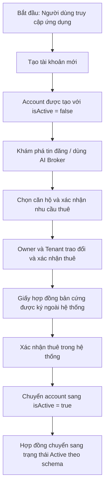

# 🏠 Kế hoạch Thiết kế và Kiến trúc Frontend - AI Apartment Monorepo

Tài liệu này đặc tả chi tiết kế hoạch phát triển và thiết kế giao diện (UI/UX) cho hệ thống Frontend của **AI Apartment Monorepo** dựa trên các nghiệp vụ hiện có của Backend (NestJS) và AI Agent (FastAPI).

---

## 1. TÓM TẮT HIỂU BIẾT & PHẠM VI (UNDERSTANDING SUMMARY)

*   **Sản phẩm:** Cổng thông tin thuê căn hộ tích hợp trợ lý AI thông minh toàn diện.
*   **Đối tượng phục vụ:**
    *   **Guest / Tenant đầu vào:** Tạo tài khoản đầu tiên với trạng thái `isActive = false`, duyệt tin công khai, sử dụng AI Broker để tìm phòng, và tiến hành xác nhận thuê.
    *   **Tenant (Khách thuê):** Sau khi xác nhận thuê thành công, tài khoản sẽ chuyển sang `isActive = true`; người dùng có thể xem hợp đồng, theo dõi trạng thái thuê và thực hiện các thao tác liên quan.
    *   **Owner (Chủ nhà):** Đăng ký căn hộ, soạn tin thô để gửi AI Verifier chuẩn hóa tự động, quản lý tin đăng và xác nhận thuê với khách.
*   **Không có vai trò Admin:** Tập trung tối đa trải nghiệm người dùng vào sự tương tác giữa Chủ nhà và Khách thuê.
*   **Ràng buộc kỹ thuật:** Không sửa đổi bất cứ logic nào của hệ thống [apps/backend](file:///D:/AI_Apartment_Monorepo/apps/backend) và [apps/ai-agent](file:///D:/AI_Apartment_Monorepo/apps/ai-agent). Chỉ sử dụng API của các ứng dụng này làm hợp đồng liên kết (API contract).

---

## 2. LUỒNG NGHIỆP VỤ TẠO TÀI KHOẢN & XÁC NHẬN THUÊ (SIMPLIFIED WORKFLOW)

Quy trình được đơn giản hóa thành một luồng duy nhất: người dùng tạo tài khoản trước, sau đó xác nhận thuê và hệ thống kích hoạt tài khoản khi thuê thành công.



### Chi tiết Quản lý Trạng thái (State Management):
*   **`isActive = false` (Tài khoản chưa kích hoạt):** Người dùng có thể tạo tài khoản, tìm kiếm căn hộ, sử dụng AI Broker và xem thông tin cơ bản. Không mở toàn bộ quyền thuê và hợp đồng.
*   **`isActive = true` (Tài khoản đã kích hoạt sau khi xác nhận thuê):** Mở khóa các quyền liên quan đến quản lý thuê, xem hợp đồng và các thao tác tiếp theo sau khi giao dịch đã được xác nhận.
*   **Hợp đồng:** Không thực hiện ký kết trực tuyến. Hệ thống chỉ cập nhật trạng thái hợp đồng sang `Active` sau khi giấy hợp đồng bản cứng đã được ký và xác nhận ngoài hệ thống.

---

## 3. CẤU TRÚC THƯ MỤC & ĐỊNH TUYẾN (ROUTING)

Ứng dụng được triển khai dưới dạng một dự án độc lập nằm tại thư mục `apps/frontend` của Monorepo.

*   **Tech Stack:** Next.js (version **16.2.10** App Router) + TypeScript + Tailwind CSS v4 + shadcn/ui.
*   **Cấu trúc thư mục:**
    ```text
    apps/frontend/src/
    ├── app/
    │   ├── layout.tsx             # Layout chung cho toàn bộ ứng dụng
    │   ├── page.tsx               # Landing Page công khai
    │   ├── (auth)/                # Route Group cho Auth (Đăng nhập, Đăng ký)
    │   ├── (tenant)/              # Route Group cho Khách thuê
    │   │   ├── search/page.tsx    # Tìm kiếm & Duyệt tin căn hộ
    │   │   ├── apartment/[id]/    # Trang chi tiết căn hộ & Đánh giá
    │   │   └── dashboard/         # Quản lý lịch hẹn, hợp đồng, hóa đơn
    │   └── (owner)/               # Route Group cho Chủ nhà
    │       └── dashboard/         # Dashboard chủ nhà, quản lý căn hộ
    ├── components/
    │   ├── ui/                    # UI Components nguyên bản từ shadcn/ui
    │   ├── shared/                # Component dùng chung (Navbar, Cards, Footer)
    │   └── ai-broker/             # Khung chat AI Broker nổi toàn cục
    └── store/
        └── useAuthStore.ts        # Quản lý JWT và cờ trạng thái isActive
    ```

---

## 4. THIẾT KẾ THẨM MỸ (VISUAL IDENTITY & SIGNATURE)

### 🎨 Visual Direction: Luxury Dark / Glassmorphism
*   **Chủ đạo:** Nền xanh đen sâu thẳm mang tính chiều sâu (`#0B0F19`) làm nổi bật các thẻ thông tin kính mờ dạng bán trong suốt (`backdrop-blur-md` với viền mỏng sáng nhạt `rgba(255,255,255,0.08)`).
*   **Điểm nhấn công nghệ:** Sử dụng màu xanh ngọc lục bảo (`#10B981`) phát sáng nhẹ để biểu thị trí tuệ nhân tạo (AI) và màu vàng hổ phách (`#F59E0B`) cho các nút hành động cốt lõi ("Thuê ngay", "Ký hợp đồng").

### 🌟 Signature Element: AI Broker Side-panel
*   Thanh chat nổi ở mép phải màn hình có hiệu ứng chuyển động trượt mượt mà (Spring Physics).
*   **Đa phương thức:** Hỗ trợ người dùng nhập liệu bằng giọng nói (Microphone ghi âm với hiệu ứng sóng âm nhấp nháy sinh động).
*   **Thẻ căn hộ tương tác:** Hiển thị trực tiếp 3 đề xuất tốt nhất dưới dạng thẻ 3D xoay nhẹ khi hover, cho phép xem nhanh thông tin mà không cần tải lại trang.

---

## 5. ÁNH XẠ API HỆ THỐNG (API-TO-PAGE MAPPING)

| Màn hình | Route | Method | Endpoint Backend / AI | Vai trò sử dụng |
| :--- | :--- | :--- | :--- | :--- |
| **Trang chủ** | `/` | - | - | Tất cả (Guest/Tenant/Owner) |
| **Tìm kiếm căn hộ** | `/search` | `GET` | `/listing/search` | Guest / Tenant |
| **Chi tiết căn hộ** | `/apartment/:id` | `GET` | `/listing/:id` | Guest / Tenant |
| **Chat AI Broker** | *Widget toàn cục* | `POST` | `/ai-agents/search` | Guest / Tenant |
| **Tạo tài khoản & bắt đầu thuê** | `/register` | `POST` | `/auth/register` | Guest / Tenant tiềm năng |
| **Xác nhận thuê & kích hoạt tài khoản** | `/tenant/dashboard/activate` | `PATCH` | `/user/:id` hoặc flow cập nhật trạng thái tài khoản | Tenant sau khi thuê được xác nhận |
| **Quản lý hợp đồng** | `/tenant/dashboard/contracts` | `GET`<br>`PATCH` | `/contract`<br>`/contract/:id` | Tenant / Owner, trạng thái hợp đồng chuyển sang `Active` sau xác nhận bản cứng |
| **Quản lý căn hộ** | `/owner/dashboard/apartments` | `GET`<br>`POST` | `/apartment/my-apartments`<br>`/apartment` | Owner |
| **Đăng tin & AI Duyệt** | `/owner/dashboard/create-listing` | `POST`<br>`POST` | `/ai-agents/verify`<br> `/listing` | Owner |

---

## 6. LỘ TRÌNH TRIỂN KHAI (ROADMAP)

*   **Phase 1: Foundation (Tuần 1):** Khởi tạo khung Next.js 16.2.10, thiết lập CSS variables hệ màu tối sang trọng, setup Zustand Store cho quản lý token và trạng thái `isActive`.
*   **Phase 2: Core User Flows (Tuần 2):** Xây dựng Landing Page, trang Tìm kiếm, trang Chi tiết căn hộ, và luồng xem Hợp đồng nháp Read-only dành cho Guest.
*   **Phase 3: AI Integration (Tuần 3):** Tích hợp Widget chat AI Broker (`POST /ai-agents/search`) và bảng đối soát tin đăng thông minh AI Verifier cho chủ nhà (`POST /ai-agents/verify`).
*   **Phase 4: Activation & Launch (Tuần 4):** Xây dựng trang kích hoạt tài khoản sau khi thuê được xác nhận, flow cập nhật trạng thái hợp đồng sang `Active` dựa trên schema, tối ưu chuyển động Framer Motion và Responsive di động.

---

## 7. NHẬT KÝ QUYẾT ĐỊNH (DECISION LOG)

| Vấn đề quyết định | Các phương án xem xét | Phương án được chọn | Lý do lựa chọn |
| :--- | :--- | :--- | :--- |
| **Kiến trúc cổng Frontend** | 1. Cổng hợp nhất Persona Switcher<br>2. Tách sub-domain độc lập<br>3. Chỉ có giao diện Chat-centric | **Phương án 1 (Hợp nhất)** | Cân bằng tốt nhất trải nghiệm chuyển đổi vai trò mà không làm mất session đăng nhập, dễ bảo trì mã nguồn trong Monorepo. |
| **Xử lý tài khoản Guest/Chưa active** | 1. Tạo tài khoản ẩn lười đăng ký<br>2. Lưu state ở client<br>3. Tạo API Guest Token riêng | **Phương án 1 (Sử dụng cờ `isActive = false`)** | Phù hợp với database schema có sẵn, đảm bảo lịch sử chat AI và Hợp đồng nháp được lưu trữ bền vững trên DB ngay từ đầu. |
| **Tech Stack hiển thị** | Next.js 15 vs Next.js 16 | **Next.js 16.2.10 App Router** | Tuân thủ chính xác yêu cầu phiên bản hạ tầng hiện tại của dự án. |
